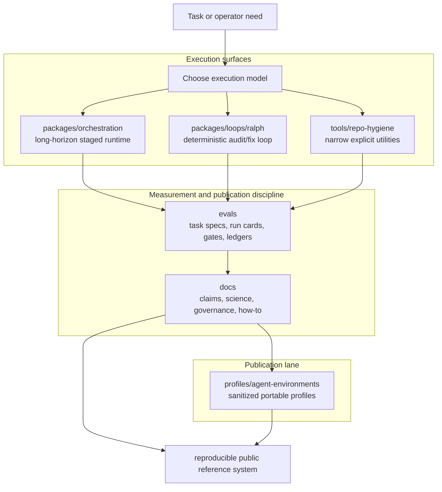
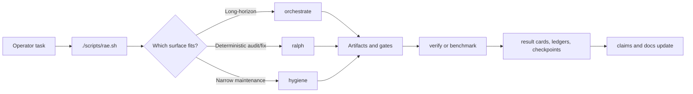

# RAE

Reliable Agentic Engineering.

Evaluation-first reference implementation for reliable agentic engineering:
phased orchestration, deterministic loop execution, narrow repo-hygiene tools,
reproducible benchmarks, and evidence-bearing docs.

This repository is meant to be more than a bundle of imported repos. Its
purpose is to turn several working codebases into one public reference system
with:

- a coherent architecture
- a scientific documentation layer
- contamination-aware benchmark doctrine
- explicit claim, assumption, and evidence handling
- reproducible local verification

The design target follows this repo's current engineering stance for reliable
agent workflows: prefer simple structures first, add autonomy only when it
measurably helps, and treat evaluation and documentation as first-class
reliability machinery.

## Core thesis

Reliable agentic systems fail for repeatable reasons:

- they mix planning, execution, and verification into one loop
- they let producers certify their own output
- they compare systems without frozen tasks, judges, or provenance
- they publish documentation that mixes theory, reference, and opinion

This repo answers that with five linked layers:

1. `packages/orchestration/`
   Multi-stage, contract-driven orchestration for long-horizon work.
2. `packages/loops/ralph/`
   Deterministic audit/lint/fix loops with atomic state handling.
3. `tools/repo-hygiene/`
   Narrow utilities for explicit maintenance operations.
4. `evals/`
   Benchmark cards, task specs, run cards, checkpoints, regression reports,
   release gates, and result ledger artifacts.
5. `docs/`
   Diataxis-structured scientific, operational, and governance documentation.

The structure is easier to understand as a layered system:



## Imported working modules

- `packages/orchestration/`
  Imported from a prior standalone phased orchestration runtime
- `packages/loops/ralph/`
  Imported from a prior standalone Ralph loop runtime
- `tools/repo-hygiene/coauthor-trailer-cleaner/`
  Imported and generalized from a prior standalone co-author trailer cleaner

The umbrella also includes a public profile publication lane under
`profiles/agent-environments/`. That lane ships a sanitized profile payload for
RAE-shaped targets, with templates, safe install/remove scripts, and regression
tests.

## Quick Start

Install and verify:

```bash
./scripts/verify.sh
```

Inspect the operator surface:

```bash
./scripts/rae.sh doctor
```

Route one task:

```bash
./scripts/rae.sh task route \
  --task-spec evals/datasets/tool-selection/tool-selection-core.task-specs.json \
  --task-id tool-selection-dev-orchestration \
  --output evals/results/local/planned-route.json
```

Run one benchmark split:

```bash
./scripts/rae.sh eval run \
  --benchmark-card evals/benchmarks/tool-selection-core.benchmark-card.json \
  --split dev \
  --output-dir evals/results/local-dev
```

Install the public profile payload into an RAE-shaped target directory:

```bash
mkdir -p /tmp/rae-profile/scripts
printf '#!/usr/bin/env bash\nexit 0\n' > /tmp/rae-profile/scripts/verify.sh
chmod +x /tmp/rae-profile/scripts/verify.sh
bash profiles/agent-environments/installers/install-profile.sh /tmp/rae-profile
```

## Umbrella Harness

The umbrella runtime entrypoint is:

```bash
./scripts/rae.sh
```

Use it to:

- inspect the local operator surface with `./scripts/rae.sh doctor`
- read umbrella workflow memory in `AGENTS.md`
- route one task spec with `./scripts/rae.sh task route ...`
- run phased orchestration with `./scripts/rae.sh orchestrate ...`
- create or supervise isolated worktree runs with `./scripts/rae.sh worktree ...`
- run or bootstrap Ralph with `./scripts/rae.sh ralph ...`
- run hygiene tooling with `./scripts/rae.sh hygiene ...`
- create or resolve explicit checkpoints with `./scripts/rae.sh checkpoint ...`
- run executable benchmark splits with `./scripts/rae.sh eval run ...`
- validate benchmark metadata with `./scripts/rae.sh eval validate`
- enforce publication gates with `./scripts/rae.sh release-gate ...`
- use scenario-oriented aliases with `./scripts/rae.sh workflow ...`

The top-level harness is intentionally thin. The imported runtimes remain the
source of truth for execution behavior; the umbrella adds routing, benchmark
execution, result ledgers, checkpoints, and publication gates.

The shared umbrella operating model lives in `AGENTS.md`. Use it for repeated
cross-repo corrections, workflow verbs, and escalation rules. Keep package
command details in package-local docs.

Use `./scripts/rae.sh orchestrate ...` for the complete orchestration command
surface. Use `./scripts/rae.sh workflow long-horizon ...` when you want the
scenario-oriented alias for that same runtime.

Use `./scripts/rae.sh worktree init ...` when long-horizon work should run in an
isolated checkout with a dedicated branch and cleanup path.

The intended operating loop looks like this:



## Public repo hygiene

This repository keeps generated state and local process artifacts out of the
published tree. In practice that means:

- benchmark baselines and schemas are committed; ad hoc local run outputs are not
- package runtimes keep their own operator docs only where those docs are part
  of the runtime contract
- local caches, `.pipeline/`, `site/`, temporary eval outputs, and machine junk
  stay ignored
- local audit notes, closure reports, and remediation scratch plans stay ignored
- the profile lane publishes only sanitized, machine-agnostic material

## Why the docs matter

The documentation layer is not decorative. It is part of the reliability model.

The repo uses:

- Diataxis separation for tutorial, how-to, reference, and explanation docs
- `research/` for benchmark doctrine and result reporting
- `governance/` for claim quality, citation, and release policy
- `reference/claims/` for the claim ledger, assumptions register, bibliography,
  and evidence index
- `CITATION.cff` for machine-readable repository citation metadata and
  `docs/reference/claims/bibliography.md` for page-level external cite keys

That structure is intended to stop four common failure modes:

- theory leaking into reference pages
- benchmark results reported without enough metadata
- implementation details presented as general science
- stale docs inheriting authority they no longer deserve

## Start here

- [Documentation Index](docs/INDEX.md)
- [Project Scope](docs/explanation/overview/project-scope.md)
- [System Overview](docs/reference/architecture/system-overview.md)
- [Claims Ledger](docs/reference/claims/claims-ledger.md)
- [Evidence Index](docs/reference/claims/evidence-index.md)
- [Benchmark Protocol](docs/research/benchmark-protocol.md)
- [Frozen Benchmark Results](docs/research/frozen-benchmark-results.md)
- [Profile Publication Guide](docs/how-to/publish-a-sanitized-profile.md)

## Verification

`./scripts/verify.sh` includes:

- strict MkDocs build
- umbrella metadata and link checks
- umbrella CLI smoke tests
- eval metadata harness validation
- executable benchmark split runs
- frozen benchmark family suite for dev and held-out splits
- judge calibration
- release gate enforcement
- public profile installation regression test
- orchestration package verification
- Ralph regression suite
- co-author trailer cleaner test suite

The verification path writes only to ignored transient locations such as
`site/`, `evals/results/.verify-*`, and package-local temporary outputs.

## Scope boundary

This repository is not trying to be:

- a monolithic agent runtime
- a prompt dump
- a benchmark leaderboard with thin methods
- a pseudo-scientific whitepaper detached from working code

It is trying to be:

- a reference architecture
- a measurement and documentation discipline
- a reproducible local system for building and studying agent workflows
