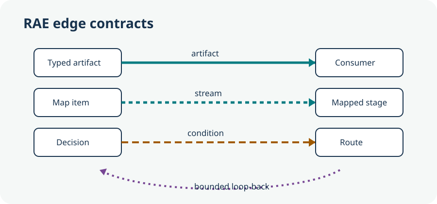
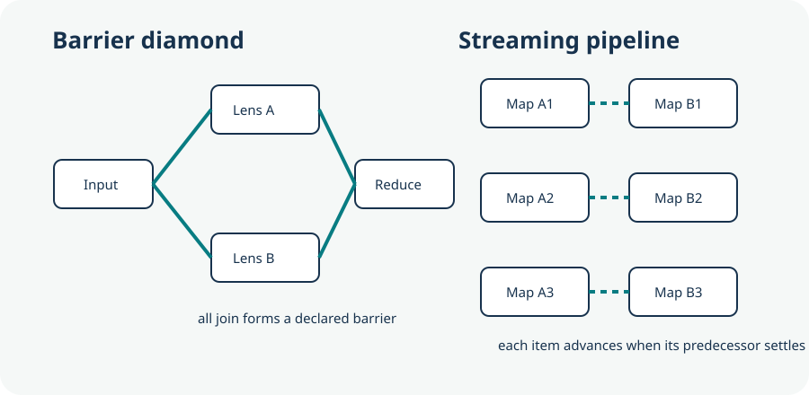
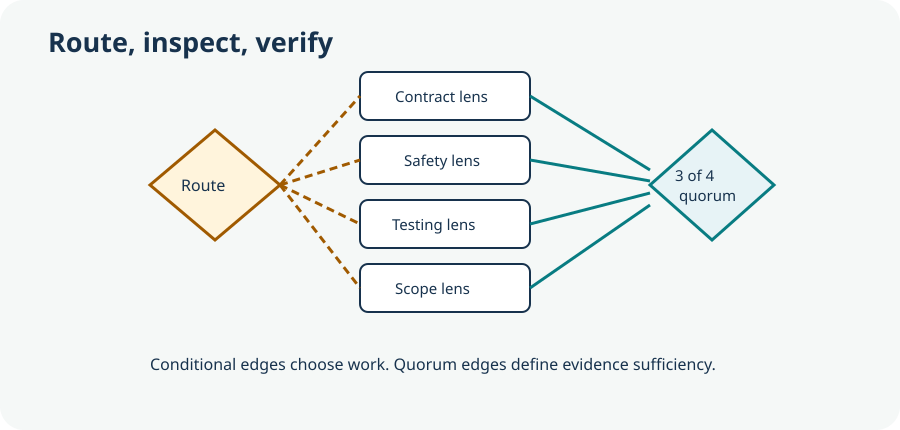
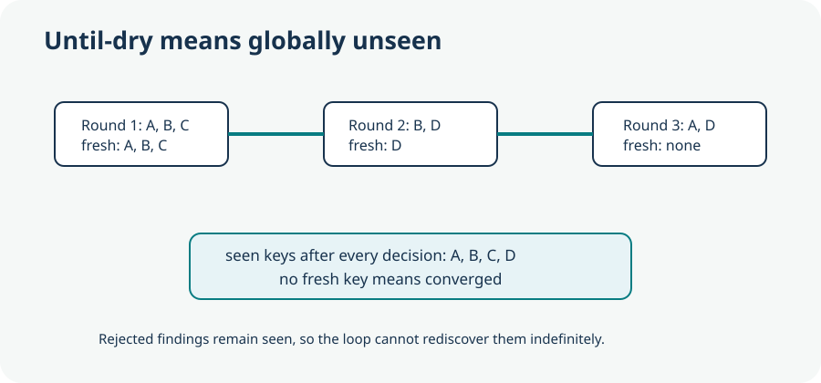
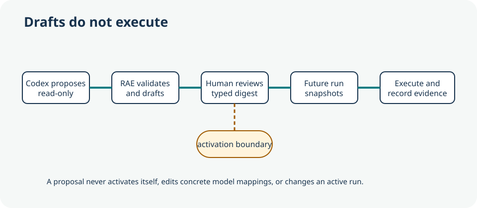

# Graph Engineering with RAE

This course has two layers. The topology layer explains what work can proceed
and what must wait. The contract layer names the workflow fields that make that
decision durable and reviewable.

RAE workflows are provider-neutral. Native Codex
[subagents](https://learn.chatgpt.com/docs/agent-configuration/subagents) are
collaborators inside one Codex task. A RAE agent node is a durable workflow
unit whose provider route is selected by the operator. Codex and OpenCode
attempts both start fresh sessions and persist only validated workflow output
and sanitized execution evidence. Writer runs use isolated Git
[worktrees](https://learn.chatgpt.com/docs/environments/git-worktrees). Nodes do
not share a model conversation.

Every agent or mapped agent instance consumes model tokens. Scheduling, joins,
condition evaluation, and allowlisted transforms do not call a model. A wider
graph can therefore increase cost even when its critical path is shorter.

## 1. Data and control edges



Topology layer: an artifact edge carries one completed envelope. A stream edge
opens the matching mapped successor as soon as one item succeeds. A condition
edge selects a route. A loop-back edge stays inside a bounded loop.

Contract layer: `edges[].type` is one of `sequence`, `artifact`, `stream`,
`condition`, or `loop-back`. Conditions are fixed vocabulary. Workflow JSON
cannot contain an expression evaluator.

## 2. Contract-bound nodes

An agent node has guidance and an optional payload contract. The runtime passes
only typed predecessor envelopes and the mapped item, when present. A node can
request a logical `economy`, `standard`, or `judgment` tier. It cannot name a
provider, model, tool, command, environment value, or reasoning effort.

The operator owns concrete provider and model selection in execution profile
3.0:

```json
{
  "schema_version": "3.0.0",
  "profile_id": "local-routing",
  "routes": {
    "routine": {
      "executor": "codex",
      "model": "operator-codex-model",
      "reasoning_effort": "medium"
    },
    "review": {
      "executor": "opencode",
      "model": "opencode/example-model",
      "variant": "high"
    }
  },
  "tiers": {
    "economy": "routine",
    "standard": "routine",
    "judgment": "review"
  }
}
```

Replace the model identifiers with models available through the selected local
executors. The profile is validated and snapshotted by digest.
`--execution-profile` cannot be combined with global provider, model,
reasoning-effort, or variant overrides. Resume requires the stored profile,
resolved routes, models, and exact executor versions. See [Execution Profile
3.0](../reference/contracts/execution-profile-v3.md) for the full contract and
OpenCode platform limits.

## 3. Diamonds and deterministic reduction



A diamond fans one artifact into independent lenses and reduces their outputs.
Use `all` when every lens is mandatory, first-success `any` when one sufficient
answer is enough, and `quorum` when a declared threshold is the evidence rule.
Already-started branches continue to settle after `any` chooses a winner, so
the evidence trace does not hide late failures.

Use a transform node for mechanical reduction. The allowlist is `select`,
`flatten`, `deduplicate`, `sort`, `limit`, `group`, and bounded `cartesian`.
Transforms operate on JSON values only.

## 4. Barriers and streaming pipelines

A normal artifact edge is a barrier at the logical-node boundary. A `stream`
edge lets one mapped successor start per successful predecessor instance. One
mapped stage can have only one stream predecessor. Map size is at most 32,
stream depth is at most four, concurrency is at most four, and a run is capped
at 128 dynamic instances or provider attempts.

Stable fan-out identity comes from an RFC 6901 pointer into each item. The
runtime records the stable key and item digest separately. Resume recreates
missing instances without repeating completed identities.

## 5. Conditional routing and diverse-lens quorum



Routing decides relevance. Quorum decides sufficiency. Keep those policies in
separate nodes so an omitted route cannot silently lower the verification
threshold. Grouped quorum can require representation from named lens groups in
addition to an overall threshold.

`collect` failure handling is valid only for read or control work that feeds an
explicit threshold join. Writers and unhandled failures remain fail-closed. A
quorum fails as soon as its remaining inputs cannot satisfy the threshold.

## 6. Retry and failure containment

Each provider attempt has a fresh session identifier and a typed envelope.
After retry exhaustion, the failed envelope remains in the trace. A workflow
does not convert an exception into success. Writer nodes remain globally
serialized in the isolated worktree, and a writer waits for active readers to
drain.

## 7. Bounded and until-dry cycles



A bounded loop stops after at most five rounds. An `until-dry` loop also stops
when a round yields no globally unseen stable key. The seen set includes every
previous decision, including rejected findings. This prevents a rejected item
from being rediscovered forever under a different round.

## 8. Design, analyze, propose, and activate



Start the loopback operator to use the synchronized Loop, Graph, Analyze, and
JSON views:

```bash
./scripts/rae.sh operator serve \
  --project /path/to/target-repository \
  --execution-profile /absolute/path/to/execution-profile.json
```

The guided editor provides single-agent verification, maker-checker repair,
parallel review with quorum, mapped work, and bounded until-dry templates. Each
template compiles to workflow 2.1. Node and edge controls are keyboard
operable; JSON remains available for existing workflow 2.0 and experimental
2.2 revisions.

Analyze a workflow file without saving it:

```bash
./scripts/rae.sh graph workflow analyze \
  --workflow-file /absolute/path/to/workflow.json \
  --execution-profile /absolute/path/to/execution-profile.json
```

The analyzer reports schema and topology diagnostics, unreachable nodes,
writer and verification paths, bounded attempt and instance estimates,
concurrency bounds, and resolved execution routes. It does not invent a cost
estimate when provider usage data is unavailable.

Generate a validated candidate without saving it:

```bash
./scripts/rae.sh graph workflow propose \
  --project-root /path/to/target-repository \
  --task "Design a bounded review topology for this repository" \
  --base-workflow graph-native-default \
  --actor "operator-name" \
  --rationale "Draft for topology review" \
  --execution-profile /absolute/path/to/execution-profile.json \
  --preview
```

The proposal session is read-only and ephemeral. RAE permits one correction
attempt after local validation. `--preview` returns the candidate without
saving it; omitting `--preview` stores a valid optimistic-lock draft. Neither
mode activates or executes the result.

Review and activate an exact revision:

```bash
./scripts/rae.sh graph workflow validate \
  --project-root /path/to/target-repository \
  --workflow graph-native-default --revision 2

./scripts/rae.sh graph workflow diff \
  --project-root /path/to/target-repository \
  --workflow graph-native-default --from 1 --to 2

./scripts/rae.sh graph workflow activate \
  --project-root /path/to/target-repository \
  --workflow graph-native-default --revision 2 \
  --digest <digest-returned-by-validation> \
  --actor "operator-name" \
  --rationale "Reviewed contracts, bounds, and writer path"
```

Activation affects future runs only. Existing runs keep their immutable 2.0 or
2.1 snapshot.

## Six topology recipes

The maintained recipe files are under
`packages/orchestration/workflows/recipes/`. Validate a recipe before using it,
then pass the same file to `agent run`.

### Route auditing

`route-audit.workflow.json` maps a bounded route inventory, applies specialist
checks, and joins all results before verification.

```bash
./scripts/rae.sh graph workflow validate --project-root "$PWD" \
  --workflow-file packages/orchestration/workflows/recipes/route-audit.workflow.json
./scripts/rae.sh agent run --project-root /path/to/target \
  --workflow "$PWD/packages/orchestration/workflows/recipes/route-audit.workflow.json" \
  --task "Audit declared routes against handlers, authorization, and tests"
```

### Cited research

`cited-research.workflow.json` separates claim collection, source checking, and
quorum synthesis. Citations remain payload data, not executable references.

```bash
./scripts/rae.sh agent run --project-root /path/to/target \
  --workflow "$PWD/packages/orchestration/workflows/recipes/cited-research.workflow.json" \
  --execution-profile /absolute/path/to/operator-profile.json \
  --task "Research the requested change and return source-backed constraints"
```

### Module migration

`module-migration.workflow.json` maps read-only module analysis, forms an
ownership plan, crosses a mutation checkpoint, and uses one serialized writer.

```bash
./scripts/rae.sh agent run --project-root /path/to/target \
  --workflow "$PWD/packages/orchestration/workflows/recipes/module-migration.workflow.json" \
  --checkpoint-policy before-mutation \
  --task "Migrate the selected modules while preserving their public contracts"
```

### Adversarial review

`adversarial-review.workflow.json` uses independent safety, contract, test, and
scope lenses with a three-of-four quorum.

```bash
./scripts/rae.sh agent run --project-root /path/to/target \
  --workflow "$PWD/packages/orchestration/workflows/recipes/adversarial-review.workflow.json" \
  --task "Review the proposed design for blocking risks"
```

### Scheduled ecosystem scanning

`ecosystem-scan.workflow.json` maps a bounded package inventory and performs a
deterministic deduplication before verification. Scheduling belongs to the
operator's local scheduler; RAE itself does not install a timer.

```bash
./scripts/rae.sh agent run --project-root /path/to/target \
  --workflow "$PWD/packages/orchestration/workflows/recipes/ecosystem-scan.workflow.json" \
  --task "Scan the declared ecosystem snapshot for actionable compatibility changes"
```

### Unknown-size discovery

`unknown-size-discovery.workflow.json` uses an until-dry loop with a 32-item
round bound and five-round ceiling.

```bash
./scripts/rae.sh agent run --project-root /path/to/target \
  --workflow "$PWD/packages/orchestration/workflows/recipes/unknown-size-discovery.workflow.json" \
  --task "Discover and inspect all previously unseen integration points"
```

## Evidence limits

The deterministic topology benchmark measures event order, fixture critical
path, and barrier idle time. It does not establish model quality or a universal
speed advantage. Provider results, hardware, repository shape, and task
difficulty remain outside that fixture's claim.

## Source note

- [Codex subagents](https://learn.chatgpt.com/docs/agent-configuration/subagents)
- [Codex non-interactive mode](https://learn.chatgpt.com/docs/non-interactive-mode)
- [Codex Git worktrees](https://learn.chatgpt.com/docs/environments/git-worktrees)
- [NIST GenAI Profile](../reference/claims/bibliography.md#src-nist-genai-profile)
- [OpenAI evals guidance](../reference/claims/bibliography.md#src-openai-evals)
- [PaperBench](../reference/claims/bibliography.md#src-openai-paperbench)
- [IEEE 1012](../reference/claims/bibliography.md#src-ieee-1012)
- [Model Cards](../reference/claims/bibliography.md#src-model-cards)
- [Datasheets](../reference/claims/bibliography.md#src-datasheets)
- [Amdahl 1967](../reference/claims/bibliography.md#src-amdahl-1967)
