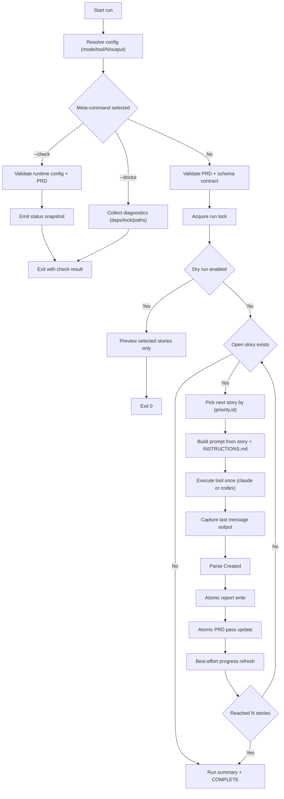
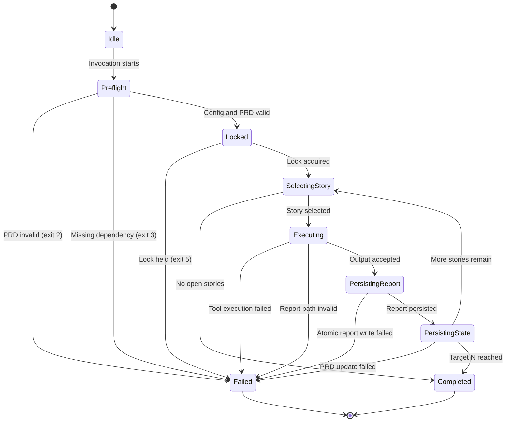

# Ralph Audit Loop

Deterministic, story-driven automation loop for repository auditing, linting, and scoped fixing.

Built for agent runs (Claude CLI or Codex CLI) where execution safety, repeatability, and atomic state updates matter more than speed or improvisation.

## Contents

- A strict loop runner: `ralph.sh`
- Modular runtime implementation in `lib/ralph/*.sh`
- A schema-validated PRD contract (`prd.json`, `prd.schema.json`, `prd.validate.jq`)
- A mode policy contract for model behavior (`INSTRUCTIONS.md`)
- Operational helper scripts for progress, learning logs, and archiving
- Regression tests for runner safety and behavior

## Core Guarantees

- Deterministic story selection (`priority`, then `id`)
- Exactly one tool execution per story attempt
- Atomic report writes
- Atomic PRD status updates
- Lock-protected state mutation (`.runtime/.run.lock`)
- Repository-constrained report path handling
- Scope enforcement in `fixing` mode using pre/post state snapshots

## Supported Layouts

### Standalone template repository

Run directly from this repository root:

```bash
MODE=audit ./ralph.sh 20
```

The shipped package defaults keep `defaults.report_dir` at
`.claude/ralph-audit/audit` so the same template also works unchanged when it
is embedded into another repository. Standalone package-root execution is still
supported; if you want reports under a local package-root directory such as
`audit/`, change `defaults.report_dir` in `prd.json` and align the story
acceptance criteria with that path.

### Embedded template in another repository

Run from target repository root:

```bash
MODE=audit ./.claude/ralph-audit/ralph.sh 20
```

The runner auto-detects both layouts. If detection is ambiguous, set:

```bash
export RALPH_REPO_ROOT=/absolute/path/to/repo
```

## Concepts

Ralph processes a **PRD** (`prd.json`) -- a JSON file containing an ordered list of **stories**. Each story defines a unit of work: what to audit, lint, or fix, which files are in scope, and where to write the report.

Stories are grouped by **mode**:

- **audit** -- read-only analysis; produces findings reports
- **linting** -- read-only; runs detected quality checks and reports results
- **fixing** -- write-enabled; applies scoped changes with pre/post state enforcement

Each run, Ralph picks the next open story (sorted by `priority`, then `id`), builds a prompt from the story data and `INSTRUCTIONS.md`, executes a single tool invocation (Claude or Codex), captures the output, writes a report, and marks the story as passed in `prd.json`. This repeats until `N` stories are processed or none remain.

A story is **open** when `passes` is `false` and `skipped` is not `true`. Once all stories for the active mode are complete, the runner emits `<promise>COMPLETE</promise>`.

## Quick Start

### 1) Validate dependencies

Required:

- `bash`
- `jq`
- `mktemp`

Required only when `N > 0` (story execution):

- `claude` (default) or `codex` (selected via `--tool codex` or `RALPH_TOOL=codex`)

Optional:

- `git` (branch sync + root fallback)
- `timeout` / `gtimeout` / `perl` (timeout helper chain)

### 2) Create or update `prd.json`

Copy `prd.json.example` to `prd.json` and customize it for your repository. The example includes one story per mode (audit, linting, fixing) to demonstrate the required structure.

### 3) Run a mode

```bash
MODE=audit ./ralph.sh 5
MODE=linting ./ralph.sh 5
MODE=fixing ./ralph.sh 3
```

If `N` is omitted, the runner uses `defaults.max_stories_default` from `prd.json`.

For all CLI options (including `--export-state`, `--import-state`, `--status`, `--validate-prd`) and exit codes (0-6), see [CLI Reference](#cli-reference).

## Loop Contract (High Level)

For each iteration:

1. Pick next open story for active mode (`passes=false`, `skipped!=true`)
2. Build prompt from story data + `INSTRUCTIONS.md`
3. Execute tool once (claude or codex)
4. Capture final message (claude: stdout; codex: `--output-last-message`)
5. Resolve report target from exactly one `Created ...` acceptance criterion
6. Write report atomically
7. Mark story pass atomically in `prd.json`
8. Continue until `N` is reached or no stories remain

When no open stories remain, the runner emits:

```xml
<promise>COMPLETE</promise>
```

## Modes

- `audit`: read-only findings and risk reports
- `linting`: read-only checks and lint/test result reporting
- `fixing`: workspace-write, but strictly story-scoped

Safety boundaries are enforced in code, not only in prompt text.

## Repository Structure

- `ralph.sh`: entrypoint and runtime wiring
- `lib/ralph/core.sh`: traps, logging, cleanup, stat helpers
- `lib/ralph/config.sh`: argument/env parsing, PRD validation, repo resolution (lock in `lock.sh`, preflight in `preflight.sh`)
- `lib/ralph/state_io.sh`: story status import/export helpers
- `lib/ralph/prd.sh`: story extraction, scope/path handling, report-path confinement checks
- `lib/ralph/prompt.sh`: prompt generation + best-effort check detection
- `lib/ralph/runner.sh`: tool execution, retries, redaction, state capture, scope enforcement, persistence
- `prd.json`: active story plan and execution state
- `prd.schema.json`: schema source of truth
- `prd.validate.jq`: runtime contract validation filter
- `INSTRUCTIONS.md`: model behavior contract for each story run
- `AGENTS.md`: concise operator/agent guide
- `scripts/*`: helper automation scripts
- `tests/*`: regression coverage for loop invariants and safety behavior

## PRD Contract Summary

Minimal required story fields:

- `id`
- `title`
- `priority`
- `mode`
- `scope[]`
- `acceptance_criteria[]` (must contain exactly one `Created ...` line)
- `passes`

Recommended optional fields for better execution quality:

- `objective`
- `steps[]`
- `verification[]`
- `out_of_scope[]`
- `notes`

See:

- `prd.json.example`
- `skills/prd/SKILL.md`
- `skills/ralph/SKILL.md`

## Runtime Artifacts and Logs

- `.runtime/events.log`: lifecycle and decision events
- `.runtime/run.log`: optional redacted tool output
- `learnings.md`: append-only reusable implementation learnings
- `archive/`: run-state snapshots from `scripts/archive_run_state.sh` (directory is in `.gitignore`)

Not committed (see `.gitignore`): `.runtime/`, `archive/`, `progress.txt`, test run dirs (e.g. `.ralph-test-*`), and temporary files.

### About `progress.txt`

`progress.txt` is a generated snapshot, not the source of truth.

- Source of truth is always `prd.json` (`stories[].passes`, `stories[].skipped`)
- Regenerate snapshot via `scripts/generate_progress.sh`
- Keep `progress.txt` out of git unless you intentionally want a frozen snapshot

## Helper Scripts

- `scripts/generate_progress.sh`: generate/update `progress.txt`
- `scripts/append_progress_entry.sh`: append one progress event to `progress.log.md`
- `scripts/record_learning.sh`: append a structured entry to `learnings.md`
- `scripts/sync_agents_from_learnings.sh`: sync latest learning note into `AGENTS.md`
- `scripts/archive_run_state.sh`: archive run state to `archive/<timestamp>-<label>/`
- `scripts/run_tests.sh`: test runner with filtering and summary output
- `scripts/bootstrap_embedded.sh`: copy this template into another repository as `.claude/ralph-audit`

## Configuration

### CLI Usage

```bash
./ralph.sh [N] \
  [--mode audit|linting|fixing] \
  [--tool codex|claude] \
  [--search|--no-search] \
  [--json] \
  [--status-format <full|compact|json>] \
  [--list-stories-format <full|ids|id+title|json>] \
  [--model-preflight|--no-model-preflight] \
  [--security-preflight|--no-security-preflight] \
  [--auto-archive|--no-auto-archive] \
  [--require-learning-entry|--no-require-learning-entry] \
  [--sync-branch|--no-sync-branch] \
  [--model <model-id>] \
  [--reasoning-effort <low|medium|high>] \
  [--timeout-seconds <seconds>] \
  [--strict-report-dir|--no-strict-report-dir] \
  [--check] [--doctor] \
  [--validate-prd] [--list-stories] [--status] [--validate-config] \
  [--dry-run] [--aggregate-reports] [--export-state] [--import-state <file>]
```

### Environment Variables

- `MODE`: `audit|linting|fixing`
- `RALPH_TOOL`: `claude` (default) or `codex` (aliases `claude-code`, `claude-cli`, `codex-cli` accepted)
- `RALPH_REPO_ROOT`: explicit repository root override
- `RALPH_MODEL`: model override
- `RALPH_REASONING_EFFORT`: `low|medium|high`
- `RALPH_TIMEOUT_SECONDS`: non-negative integer timeout (legacy: `CODEX_TIMEOUT_SECONDS`)
- `RALPH_MAX_ATTEMPTS_PER_STORY`: integer `>=1`
- `RALPH_SKIP_AFTER_FAILURES`: non-negative integer
- `RALPH_SEARCH_ENABLED_BY_DEFAULT`: `true|false`
- `RALPH_REQUIRE_EXTERNAL_REFERENCES_ON_SEARCH`: `true|false`
- `RALPH_OUTPUT_FORMAT`: `text|json`
- `RALPH_STATUS_FORMAT`: `full|compact|json`
- `RALPH_LIST_STORIES_FORMAT`: `full|ids|id+title|json`
- `RALPH_MODEL_PREFLIGHT`, `RALPH_SECURITY_PREFLIGHT`, `RALPH_SECURITY_PREFLIGHT_FAIL_ON_RISK`: `true|false`
- `RALPH_AUTO_ARCHIVE_ON_PROJECT_CHANGE`, `RALPH_SYNC_BRANCH_FROM_PRD`: `true|false`
- `RALPH_REQUIRE_LEARNING_ENTRY_FOR_FIXING`, `RALPH_AUTO_PROGRESS_LOG_APPEND`, `RALPH_AUTO_PROGRESS_REFRESH`, `RALPH_AUTO_SYNC_AGENTS_FROM_LEARNINGS`: `true|false`
- `RALPH_STRICT_REPORT_DIR`: `true|false`
- `RALPH_FIXING_STATE_METHOD`: `auto|full|git`
- `RALPH_STALE_LOCK_NO_PID_SECONDS`: non-negative integer
- `RALPH_VERBOSITY`: `normal|quiet|verbose`
- `RALPH_CLAUDE_PERMISSION_MODE`: override Claude CLI `--permission-mode` (default: `bypassPermissions`)

## Operations

### Daily Workflow

1. Update `prd.json`.
2. Run one mode with small `N`.
3. Inspect generated reports.
4. Check `.runtime/events.log` for traceability.
5. Iterate.

### Common Commands

```bash
MODE=audit ./ralph.sh 3
MODE=linting ./ralph.sh 3
MODE=fixing ./ralph.sh 1
```

Read-only checks:

```bash
./ralph.sh --check
./ralph.sh --doctor
```

Tail runtime events:

```bash
tail -n 200 -f .runtime/events.log
```

Optional redacted tool output:

```bash
RALPH_CAPTURE_TOOL_OUTPUT=true MODE=audit ./ralph.sh 1
tail -n 200 -f .runtime/run.log
```

<a id="loop-flow"></a>
## How It Works



## Lifecycle



## CLI Reference

- `--status`: prints status snapshot (supports `--status-format`)
- `--list-stories`: lists open stories (supports `--list-stories-format`)
- `--validate-config`: validates runtime, PRD, deps, lock visibility
- `--check`: read-only `validate-config` + status snapshot
- `--doctor`: read-only diagnostics for paths, deps, lock, strict report-dir readiness
- `--json`: machine-readable output mode for command outputs and event stream
- `--validate-prd`: PRD-only validation
- `--dry-run`: show planned loop execution without tool execution/persistence
- `--aggregate-reports`: writes report summary under `defaults.report_dir`
- `--export-state`: outputs story status JSON
- `--import-state <file>`: imports story status JSON by story id (status fields only)
- `--reset-story <id>`: reset a specific story to open state for re-processing
- `--retry-failed`: reset all skipped stories to open state
- `--no-color`: disable colored terminal output (also respects `NO_COLOR` env var)
- `--version`: show version and exit

## Embedding This Template

```bash
./scripts/bootstrap_embedded.sh /absolute/path/to/target-repo
```

Options:

- `--force`: replace existing `.claude/ralph-audit`
- `--with-tests`: also copy template tests into embedded target

## Documentation Index

- **Entry:** [README.md](README.md) (this file), [AGENTS.md](AGENTS.md) (runbook)
- **Policy:** [INSTRUCTIONS.md](INSTRUCTIONS.md), [CONTRIBUTING.md](CONTRIBUTING.md), [SECURITY.md](SECURITY.md), [CHANGELOG.md](CHANGELOG.md)
- **AI Agent Guide:** [CLAUDE.md](CLAUDE.md)
- **Skills:** [skills/prd/SKILL.md](skills/prd/SKILL.md), [skills/ralph/SKILL.md](skills/ralph/SKILL.md)
- **State:** [learnings.md](learnings.md)

## Testing

```bash
shellcheck ralph.sh scripts/*.sh lib/ralph/*.sh tests/*.sh
bash scripts/run_tests.sh              # full regression suite
bash scripts/run_tests.sh scope        # filtered by pattern
```

## Troubleshooting

### `Invalid prd.json structure or story constraints`

- Validate against `prd.schema.json`
- Check `prd.validate.jq` expectations
- Confirm required defaults and story fields are present

### Story marked skipped unexpectedly

- Check `RALPH_SKIP_AFTER_FAILURES`
- Inspect `.runtime/events.log` for `STORY_FAIL` and `STORY_SKIPPED`

### Scope violation in `fixing`

- Verify story `scope` patterns
- Check ordered include/exclude semantics (`!pattern` exclusions)
- Review changed paths in error output

### Missing tool dependency

- For `N > 0`, ensure `claude` (or `codex` if `--tool codex`) is installed and in `PATH`

## Security Notes

- Never place secrets directly in reports
- Security preflight can warn/fail on sensitive env vars (`RALPH_SECURITY_PREFLIGHT*`)
- Report writes are repository-confined and path-validated

For disclosure process, see [`SECURITY.md`](SECURITY.md).

## Contributing

See [`CONTRIBUTING.md`](CONTRIBUTING.md).

## License

MIT. See [`LICENSE`](LICENSE).
