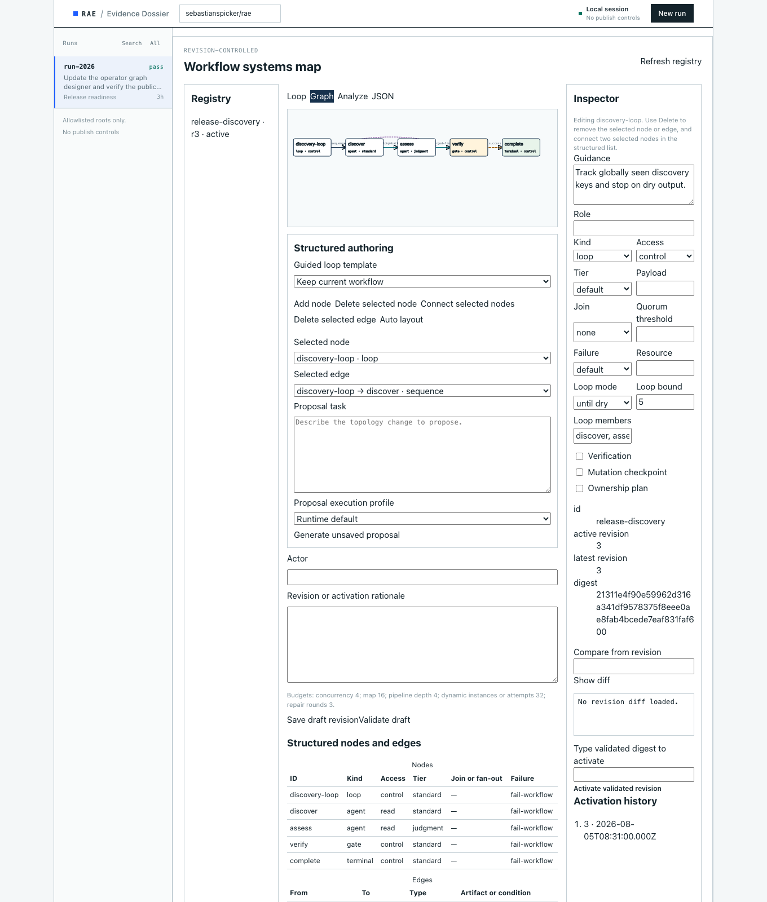
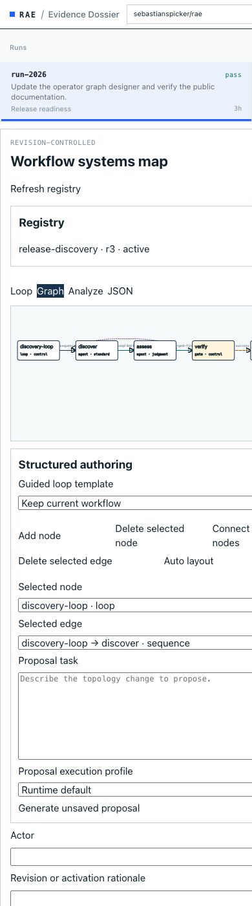

# RAE loopback operator console

Evidence Dossier UI for durable autonomous-run state under `.pipeline/`. It binds
only to `127.0.0.1`, uses an ephemeral port by default, and does not expose raw
provider traces. The static surface is a case-file layout (bound ledger table,
in-flow human checkpoint) served as modular CSS/JS under `static/css/` and
`static/js/`.

## Screenshots

Sanitized layout captures use the maintained CSS and fixture data. They are not
evidence from a real run:





Regenerate both captures from the current operator UI and the sanitized graph
fixture:

```bash
node packages/orchestration/operator/scripts/capture-docs-screenshots.mjs
```

The capture script requires a local Chrome or Chromium installation. It starts
an ephemeral loopback fixture server and does not read repository run state.

Start it with one or more canonical Git roots:

```bash
node packages/orchestration/operator/server.mjs \
  --project /absolute/path/to/repository
```

The supported umbrella form is:

```bash
./scripts/rae.sh operator serve --project /absolute/path/to/repository
```

Preload one or more server-owned execution profiles with repeatable
`--execution-profile <file>` arguments. Profile paths and credentials stay on
the server. The browser receives only sanitized IDs, routes, models, and
readiness.

The server prints one URL. Its 256-bit session token appears only in the URL
fragment. The app removes the fragment from browser history and keeps the token
in memory for bearer-authenticated API and event-stream requests.

## Remote upstream mode

To use the same local console with a separately hosted operator API, keep the
browser session on loopback and configure an upstream origin and an owner-only
credential file:

```bash
./scripts/rae.sh operator serve \
  --remote-url https://operator.example \
  --token-file /absolute/path/to/operator-token
```

Remote mode cannot be combined with `--project`. The browser still reaches only
the ephemeral local URL and sends only its local session bearer. The server
reads the upstream bearer token from `--token-file` for every forwarded request;
it is never included in browser JavaScript, local API responses, or errors.

`--remote-url` must be an origin-only HTTPS URL. HTTP is accepted only for an
explicit loopback development origin. The token file must be a regular file
owned by the current user, with no group or world permissions; symlinks and
unsafe files are rejected. Token rotation therefore takes effect on the next
request without restarting the console.

Remote mode is a fixed API relay, not a general proxy. It rejects redirects and
forwards only the `/api/v1` methods used by this console, including the listed
run, event, control, and workflow-editor routes. Request bodies are limited to
64 KiB and upstream responses to 1 MiB.

## API

All `/api/v1` requests require the session bearer token and an exact loopback
`Host`. State-changing requests also require the exact loopback `Origin`.

- `GET /api/v1/projects`
- `GET /api/v1/projects/:projectId/execution-profiles`
- `GET|POST /api/v1/projects/:projectId/runs`
- `GET /api/v1/projects/:projectId/runs/:runId`
- `GET /api/v1/projects/:projectId/runs/:runId/events`
- `GET /api/v1/projects/:projectId/runs/:runId/events/stream`
- `POST .../:runId/stop`
- `POST .../:runId/resume`
- `POST .../:runId/interrupt`
- `POST .../:runId/checkpoint-decision`
- `POST .../:runId/cleanup`
- `GET /api/v1/projects/:projectId/workflows`
- `GET /api/v1/projects/:projectId/workflows/:workflowId`
- `GET|POST /api/v1/projects/:projectId/workflows/templates`
- `POST /api/v1/projects/:projectId/workflows/:workflowId/analysis`
- `POST /api/v1/projects/:projectId/workflows/:workflowId/proposals`
- `GET /api/v1/projects/:projectId/workflows/:workflowId/proposals/:jobId`
- `POST /api/v1/projects/:projectId/workflows/:workflowId/drafts`
- `GET /api/v1/projects/:projectId/workflows/:workflowId/diff`
- `POST /api/v1/projects/:projectId/workflows/:workflowId/revisions/:revision/validate`
- `POST /api/v1/projects/:projectId/workflows/:workflowId/revisions/:revision/activate`

Start accepts `task`, `checkpoint_policy`, and an optional preloaded
`execution_profile_id`. It never accepts a profile path. Interrupt and cleanup
require `confirm_run_id` to exactly match the selected run. A checkpoint
decision requires its opaque `checkpoint_id`, an opaque `decision_id`, one of
`approve`, `reject`, or `escalate`, and a non-empty `rationale`. The server
records the actor as `rae-loopback-operator`.

The console never accepts in-place execution, command providers, environment
overrides, raw trace access, forced cleanup, commit, push, or publish controls.
Cleanup delegates to the pipeline's ownership- and dirty-state-validating
worktree cleanup operation.

The workflow editor provides synchronized Loop, Graph, Analyze, and JSON views.
It compiles five guided templates to workflow 2.1, exposes keyboard-operable
node and edge controls, analyzes unsaved revisions, and loads validated proposal
jobs into the unsaved editor. Saving a revision and activating its exact digest
remain separate human actions. Workflow 2.0 and experimental 2.2 stay available
through the expert JSON view. Registry mutations are rejected while any
allowlisted project run is active.

Proposal creation is asynchronous. A request accepts only `task`, optional
`base_revision`, and optional `execution_profile_id`; task text is limited to
32 KiB and the in-memory queue holds at most 12 jobs. The result is validated
before it is returned to the editor. The proposal endpoint does not save a
revision, activate a digest, or start a run.

Run projections include bounded graph health counts when a projection exists:
availability, validation state, node and edge counts, stale-source count, and
stale-memory and unresolved-conflict counts. The API does not expose raw graph
records, absolute paths, prompts, provider metadata, or untrusted memory text.

Only one process started by a server instance may be active at once. Interrupt
signals that owned process group, records `interrupted` after it exits, and
removes an autonomous lock only when its recorded PID matches the owned child.
POSIX process groups cannot prove termination of a descendant that deliberately
creates a new session, so interrupt responses expose `containment_uncertain`;
inspect the workspace and provider activity before reusing an interrupted run.
Start defaults to checkpoints before both mutation and release.

## Verification

```bash
node --test packages/orchestration/operator/tests/*.test.mjs
```
